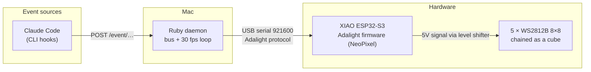

# Claudine Cube — event-reactive LED cube


Five 8×8 addressable LED panels (320 pixels total) arranged as a **cube**,
driven by a XIAO ESP32-S3, displaying a short animated reaction for each
Claude Code lifecycle event: session start/end, tool use, subagents, task
creation, compaction, idle, etc. The most recent event stays displayed until
the next one arrives. A local **admin web page** lets you tune the running cube
live — brightness, animation theme, enable/disable the source — preview any
animation, and watch its status.

This is an evolution of the original **Claudine** flat 16×16 panel. The
software principle is unchanged — only the geometry (flat → cube) and the
microcontroller (ESP32-S3-DevKitC-1 → XIAO ESP32-S3) differ.

**Status: done.** Hardware assembled and tested, software ported to the cube
geometry, LED mapping calibrated on the real cube (including the top-face
rotation), and a cube-native animation set is the default. See
[CLAUDE.md](CLAUDE.md) for the full state and the non-obvious gotchas.

---

## Principle

**The Mac does all the thinking, the ESP32 is "dumb".** All animation logic
lives in a Ruby daemon; the XIAO runs a minimal firmware that receives pixel
frames and pushes them out to the chained matrices.



**Source ↔ render decoupling**: adding a new source never touches the render
path, and vice versa. Every source just pushes an event onto the internal
bus.

---

## The cube

Five faces are lit; the sixth (the bottom, hidden on the table) is a
**removable wooden panel** giving access to the central PCB.

```
        ┌───────────┐
        │  top (4)  │        Chain order (DIN → DOUT):
        │           │          0  front
   ┌────┼───────────┼────┐     1  right
   │left│  front(0) │rght│     2  back
   │(3) │           │(1) │     3  left
   └────┼───────────┼────┘     4  top
        │ (bottom:  │
        │ removable │        320 LEDs = 5 × 64
        │  access)  │
        └───────────┘
```

- 5 × BTF-LIGHTING WS2812B 8×8 (64 px each), glued on plywood faces.
- Central PCB (XIAO + level shifter + passives) mounted inside on nylon
  standoffs.
- 18 mm plywood base holding the DC jack, on/off switch and panel-mount
  USB-C (data) connector; raised on rubber feet for airflow.

Logical coordinates used everywhere: **x = column (0 left … 7 right),
y = row (0 bottom … 7 top)** per face; `CubeMapping.index(face, x, y)` absorbs
the physical wiring. See [HARDWARE.md](docs/HARDWARE.md).

---

## Documentation

- **[CLAUDE.md](CLAUDE.md)** — start here: hardware summary, firmware gotchas
  (NeoPixel not FastLED, RX buffer), LED mapping, delivered software.
- **[HARDWARE.md](docs/HARDWARE.md)** — components, wiring, star power topology,
  power-up sequence, lessons learned.
- **[SOFTWARE.md](docs/SOFTWARE.md)** — the three software components (Ruby
  daemon, ESP32 firmware, and the **admin web server**); architecture, Adalight
  protocol, animation sets, connectors.
- **[INTENTIONS.md](docs/INTENTIONS.md)** — the intention vocabulary: the
  source ↔ rendering contract (**implemented**) that lets animations target
  neutral states (`think`, `start`, `fork`…) instead of Claude Code hooks.
- **[cube_animation_snippets.md](docs/cube_animation_snippets.md)** — set-aside
  effects for reuse.

---

## Quick start

Prerequisites:

- Hardware assembled per [HARDWARE.md](docs/HARDWARE.md) (done).
- Firmware flashed on the XIAO (see below).
- Ruby 4.0.5 (via rbenv, see `.ruby-version`).

```bash
bundle install
ruby claudine.rb
```

The serial port is `config/settings.rb → PORT` (the XIAO enumerates as
`/dev/cu.usbmodem11201` here; run `ls /dev/cu.*` to confirm yours). Close the
Arduino IDE Serial Monitor before launching, otherwise "port busy". Clean
shutdown: `Ctrl-C`.

### Firmware

`sketch_firmware/sketch_firmware.ino`, Arduino IDE board **XIAO_ESP32S3**,
library **Adafruit NeoPixel** (not FastLED — see [CLAUDE.md §3](CLAUDE.md) for
why). Key points: `DATA_PIN 1`, `NUM_LEDS 320`, and
`Serial.setRxBufferSize(4096)` before `Serial.begin()` (this last one is what
fixed the "colors garbled past LED ~100" bug). Flash with USB only, DC jack
unplugged.

### Preview the animations without Claude Code

```bash
ruby test/test_cube_preview.rb                 # all intentions in sequence, on the cube
ruby test/test_cube_preview.rb think handled   # only these intentions
ruby test/test_cube_animations.rb              # dry-run, no hardware (CI-friendly)
```

Geometry checks: `test/test_cube_faces.rb` (one color per face),
`test/test_cube_edge.rb` (all shared edges, both sides, one color each).

### Testing hooks manually

The daemon exposes a tiny HTTP server on `127.0.0.1:9292`:

```bash
curl -sX POST http://127.0.0.1:9292/event/session_start
curl -sX POST http://127.0.0.1:9292/event/pre_tool
curl -sX POST http://127.0.0.1:9292/event/task_done
```

Verbose logs: `CLAUDINE_LOG_LEVEL=DEBUG ruby claudine.rb`.
Brightness override (test different levels): `CLAUDINE_BRIGHTNESS=0.12 ruby claudine.rb`
(default `0.08`; higher draws more current/heat — keep the DC jack plugged in).

### Live control (admin page)

`ruby claudine.rb` also starts a small admin web server on
**http://localhost:9293** (self-contained, no build, no external assets). From
it you can, live:

- watch a **status** panel (current animation, last event, uptime);
- **enable/disable** the Claude Code source (when off, the cube goes dark);
- switch the **animation theme** (`cube` / `bunny`);
- **trigger** any intention once — to preview it or demo without Claude Code;
- adjust **brightness** (capped at a safe `0.25` by default; higher is a
  session-only boost with a "plug the DC jack" warning).

Settings persist to `~/.claudine` (user-level, outside the repo). This admin
server is a *control plane*, separate from the Claude Code hook endpoint
(`:9292`), which is untouched. See
[SOFTWARE.md](docs/SOFTWARE.md#3--the-admin-web-server--user-facing-control-plane).

### Animation sets

Each set is a directory under `lib/animations/` with one file per **intention**
(neutral state verbs — see [docs/INTENTIONS.md](docs/INTENTIONS.md)), chosen with
`CLAUDINE_ANIMATION_SET` (default `cube`). A profile maps Claude Code hooks onto
those intentions, so animations aren't tied to Claude Code. The `cube` set is
text-free and volumetric (the flat Claudine sets were removed); each state has a
distinct **motion signature**, not just a color (the maintainer is mildly
colorblind). A second, complete set, `bunny` (rabbits, all 16 intentions), reuses
the cube geometry (`Cube::CubeBase`) and stages rabbits for every intention
(rainbow wake-up, hops around the ring, dances, waving, an angry rabbit, sleep,
etc.).

---

## The `cube` animation set

Indexed by intention (the Claude Code hook that maps to each is in parentheses;
full mapping in [docs/INTENTIONS.md](docs/INTENTIONS.md)):

| Intention | Rendering | Motion signature |
|---|---|---|
| `welcome` (session_start) | green breathing, whole cube | global breathe |
| `bye` (session_end) | white→black fade | monotone fade-out |
| `think` (user_prompt) | wave rises the 4 sides, then rings inward on top — **loops** while thinking | repeating rising crest |
| `start` (pre_tool) | amber column orbiting, extended onto the top rim | rotating column |
| `finish` (post_tool) | single blue flash | one decaying flash |
| `retry` (post_tool_fail) | **double** red blink | two sharp blinks |
| `stop` (stop) | calm blue breathing | slow, never fully off |
| `fail` (stop_failure) | ample red pulse | steady insistent pulse |
| `fork` (subagent_start) | purple dot orbiting | fast orbit |
| `join` (subagent_stop) | central ring fading | full ring fade |
| `save` (pre_compact) | thin lines converge to center (ephemeral) | converge |
| `saved` (post_compact) | thin lines expand from center (ephemeral) | expand |
| `wait` (notification) | amber square blink | crisp on/off |
| `handle` (task_new) | outer/inner rings alternate on all 5 faces | alternating rings |
| `handled` (task_done) | green wave rises + fills top inward | rising fill → inward rings |
| `sleep` (system_idle) | dim night-blue breathe + slow orbiting spark | very slow, very dim |

`lib/animations/cube/_base.rb` provides the shared volumetric helpers
(`ring_px`, `ring_row`, `face_ring`, `top_ring`, `top_edge_px`). Tuning knobs
live as constants at the top of each animation.

**Working-state model.** The `think` intention (ambient) starts a persistent
"busy/working" loop that keeps playing (the thinking indicator); pulse intentions
(`start` / `finish` and the other momentary ones) overlay it for a beat then hand
back to the loop; boundary intentions (`stop` / `fail` / `bye`) end it. So the
cube stays alive from prompt to stop instead of going dark between events. The
temporal role comes from each intention's `kind`. See
[SOFTWARE.md](docs/SOFTWARE.md#working-state-model-background--overlays).

---

## Project layout

```
claudine-cube/
├─ claudine.rb              # Daemon entry point
├─ config/settings.rb       # Serial, geometry (8×8×5=320), ports, theme + brightness defaults
├─ lib/
│  ├─ cube_mapping.rb       # (face,x,y) → chain index (+ self-test)
│  ├─ panel.rb              # per-face API via CubeMapping (no serpentine/FLIP)
│  ├─ animation_manager.rb  # loads the active set, dispatches events
│  ├─ config.rb, status.rb  # live settings (~/.claudine) + runtime snapshot
│  ├─ animations/cube/      # default set: 16 intentions + _base.rb (volumetric)
│  ├─ connectors/           # claude_code.rb (:9292) + admin_server.rb (:9293) + admin/index.html
│  └─ …                     # Runner, EventBus, Event, logger, intentions, profiles
├─ sketch_firmware/         # XIAO firmware (NeoPixel, DATA_PIN 1, NUM_LEDS 320)
└─ test/                    # cube geometry + animation + admin tests
```

---

## Future ideas

The evolution backlog lives in one place: **[docs/IDEAS.md](docs/IDEAS.md)**,
organized by maturity —

- the **animation marketplace** (vision): safe sharing of third-party
  animations — see [docs/MARKETPLACE.md](docs/MARKETPLACE.md);
- smaller near-term ideas (random variants, more event sources, cross-face
  effects, payload-aware animations, scrolling text around the ring).

The **intention layer** (which decouples the cube from Claude Code — animations
target neutral states like `think`/`start`/`fork`) is **shipped**; see
[docs/INTENTIONS.md](docs/INTENTIONS.md).
