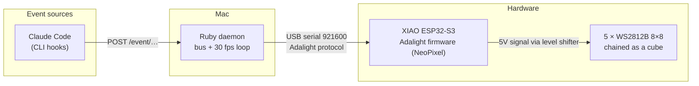

# Claudine Cube — event-reactive LED cube

Five 8×8 addressable LED panels (320 pixels total) arranged as a **cube**,
driven by a XIAO ESP32-S3, displaying a short animated reaction for each
Claude Code lifecycle event: session start/end, tool use, subagents, task
creation, compaction, idle, etc. The most recent event stays displayed until
the next one arrives.

This is an evolution of the original **Claudine** flat 16×16 panel. The
software principle is unchanged — only the geometry (flat → cube) and the
microcontroller (ESP32-S3-DevKitC-1 → XIAO ESP32-S3) differ.

**Status: done.** Hardware assembled and tested, software ported to the cube
geometry, LED mapping calibrated on the real cube (including the top-face
rotation), and a cube-native animation set is the default. See
[CLAUDE.md](CLAUDE.md) for the full state and the non-obvious gotchas.

---

## Principle

**The Mac does all the thinking, the ESP32 is "dumb".** All animation logic
lives in a Ruby daemon; the XIAO runs a minimal firmware that receives pixel
frames and pushes them out to the chained matrices.



**Source ↔ render decoupling**: adding a new source never touches the render
path, and vice versa. Every source just pushes an event onto the internal
bus.

---

## The cube

Five faces are lit; the sixth (the bottom, hidden on the table) is a
**removable wooden panel** giving access to the central PCB.

```
        ┌───────────┐
        │  top (4)  │        Chain order (DIN → DOUT):
        │           │          0  front
   ┌────┼───────────┼────┐     1  right
   │left│  front(0) │rght│     2  back
   │(3) │           │(1) │     3  left
   └────┼───────────┼────┘     4  top
        │ (bottom:  │
        │ removable │        320 LEDs = 5 × 64
        │  access)  │
        └───────────┘
```

- 5 × BTF-LIGHTING WS2812B 8×8 (64 px each), glued on plywood faces.
- Central PCB (XIAO + level shifter + passives) mounted inside on nylon
  standoffs.
- 18 mm plywood base holding the DC jack, on/off switch and panel-mount
  USB-C (data) connector; raised on rubber feet for airflow.

Logical coordinates used everywhere: **x = column (0 left … 7 right),
y = row (0 bottom … 7 top)** per face; `CubeMapping.index(face, x, y)` absorbs
the physical wiring. See [HARDWARE.md](docs/HARDWARE.md).

---

## Documentation

- **[CLAUDE.md](CLAUDE.md)** — start here: hardware summary, firmware gotchas
  (NeoPixel not FastLED, RX buffer), LED mapping, delivered software.
- **[HARDWARE.md](docs/HARDWARE.md)** — components, wiring, star power topology,
  power-up sequence, lessons learned.
- **[SOFTWARE.md](docs/SOFTWARE.md)** — daemon architecture, firmware, Adalight
  protocol, cube animation set, connectors.
- **[cube_animation_snippets.md](docs/cube_animation_snippets.md)** — set-aside
  effects for reuse.

---

## Quick start

Prerequisites:

- Hardware assembled per [HARDWARE.md](docs/HARDWARE.md) (done).
- Firmware flashed on the XIAO (see below).
- Ruby 4.0.5 (via rbenv, see `.ruby-version`).

```bash
bundle install
ruby claudine.rb
```

The serial port is `config/settings.rb → PORT` (the XIAO enumerates as
`/dev/cu.usbmodem11201` here; run `ls /dev/cu.*` to confirm yours). Close the
Arduino IDE Serial Monitor before launching, otherwise "port busy". Clean
shutdown: `Ctrl-C`.

### Firmware

`sketch_firmware/sketch_firmware.ino`, Arduino IDE board **XIAO_ESP32S3**,
library **Adafruit NeoPixel** (not FastLED — see [CLAUDE.md §3](CLAUDE.md) for
why). Key points: `DATA_PIN 1`, `NUM_LEDS 320`, and
`Serial.setRxBufferSize(4096)` before `Serial.begin()` (this last one is what
fixed the "colors garbled past LED ~100" bug). Flash with USB only, DC jack
unplugged.

### Preview the animations without Claude Code

```bash
ruby test/test_cube_preview.rb                 # all hooks in sequence, on the cube
ruby test/test_cube_preview.rb user_prompt task_done   # only these
ruby test/test_cube_animations.rb              # dry-run, no hardware (CI-friendly)
```

Geometry checks: `test/test_cube_faces.rb` (one color per face),
`test/test_cube_edge.rb` (all shared edges, both sides, one color each).

### Testing hooks manually

The daemon exposes a tiny HTTP server on `127.0.0.1:9292`:

```bash
curl -sX POST http://127.0.0.1:9292/event/session_start
curl -sX POST http://127.0.0.1:9292/event/pre_tool
curl -sX POST http://127.0.0.1:9292/event/task_done
```

Verbose logs: `CLAUDINE_LOG_LEVEL=DEBUG ruby claudine.rb`.
Brightness override (test different levels): `CLAUDINE_BRIGHTNESS=0.12 ruby claudine.rb`
(default `0.08`; higher draws more current/heat — keep the DC jack plugged in).

### Animation sets

Each set is a directory under `lib/animations/` with one file per Claude Code
hook, chosen with `CLAUDINE_ANIMATION_SET` (default `cube`). The `cube` set is
text-free and volumetric (the flat Claudine sets were removed); each event has a
distinct **motion signature**, not just a color (the maintainer is mildly
colorblind). A second set, `bunny` (rabbits), is in progress — it reuses the
cube geometry (`Cube::CubeBase`) and currently covers `session_start`,
`session_end` and `user_prompt`.

---

## The `cube` animation set

| Hook | Rendu | Motion signature |
|---|---|---|
| `session_start` | green breathing, whole cube | global breathe |
| `session_end` | white→black fade | monotone fade-out |
| `user_prompt` | wave rises the 4 sides, then rings inward on top — **loops** while thinking | repeating rising crest |
| `pre_tool` | amber column orbiting, extended onto the top rim | rotating column |
| `post_tool` | single blue flash | one decaying flash |
| `post_tool_fail` | **double** red blink | two sharp blinks |
| `stop` | calm blue breathing | slow, never fully off |
| `stop_failure` | ample red pulse | steady insistent pulse |
| `subagent_start` | purple dot orbiting | fast orbit |
| `subagent_stop` | central ring fading | full ring fade |
| `pre_compact` | thin lines converge to center (ephemeral) | converge |
| `post_compact` | thin lines expand from center (ephemeral) | expand |
| `notification` | amber square blink | crisp on/off |
| `task_new` | outer/inner rings alternate on all 5 faces | alternating rings |
| `task_done` | green wave rises + fills top inward | rising fill → inward rings |
| `system_idle` | dim night-blue breathe + slow orbiting spark | very slow, very dim |

`lib/animations/cube/_base.rb` provides the shared volumetric helpers
(`ring_px`, `ring_row`, `face_ring`, `top_ring`, `top_edge_px`). Tuning knobs
live as constants at the top of each animation.

**Working-state model.** `user_prompt` starts a persistent "busy/working" loop
that keeps playing (the thinking indicator); `pre_tool` / `post_tool` and the
other momentary events overlay it for a beat then hand back to the loop; `stop`
(and `stop_failure` / `session_end`) ends it. So the cube stays alive from
prompt to stop instead of going dark between events. See
[SOFTWARE.md](docs/SOFTWARE.md#working-state-model-background--overlays).

---

## Project layout

```
claudine-cube/
├─ claudine.rb              # Daemon entry point
├─ config/settings.rb       # Port, baud, size (8×8×5=320), brightness, faces
├─ lib/
│  ├─ cube_mapping.rb       # (face,x,y) → chain index (+ self-test)
│  ├─ panel.rb              # per-face API via CubeMapping (no serpentine/FLIP)
│  ├─ animation_manager.rb  # loads the active set, dispatches events
│  ├─ animations/cube/      # default set: 16 hooks + _base.rb (volumetric)
│  └─ …                     # Runner, EventBus, Event, connectors, logger
├─ sketch_firmware/         # XIAO firmware (NeoPixel, DATA_PIN 1, NUM_LEDS 320)
└─ test/                    # cube geometry + animation tests
```

---

## Future ideas

- **Random variants** for frequent events (`post_tool_2.rb`, …) to avoid
  repetition — the manager already picks one variant at random per hook.
- **Calibrate the other three side↔top edges** (`top_edge_px`) so effects can
  cross any edge cleanly, not just front→top.
- **More event sources** (Slack, GitHub, Outlook): a new source is just a file
  in `lib/connectors/` pushing onto the bus — the render path is untouched.
- **Cross-face effects**: "liquid" pouring from the top down the sides,
  per-category propagation around the ring, etc.
- **Bring back text** on a single face by porting `lib/text/renderer.rb` to the
  per-face `panel.set` API (it still uses the old positional signature).

### Animation editor for non-developers

Goal: let humans create cube animations without writing Ruby. Three barriers to
lift, best tackled in this order (the first has value on its own):

1. **Cube simulator (do this first).** See the cube without the cube, reusing
   the existing animation code unchanged: a `SimPanel` implements the same API
   as `Panel` (`set`/`fill_face`/`show`) but records `(face, x, y, rgb)` instead
   of pushing Adalight; a headless run streams frames as JSON to a web page that
   renders the cube as an **unfolded net** (the 5 faces in a cross — the natural
   editing surface) plus an optional **3D view** (three.js), with a timeline
   scrubber and hot-reload on save. Instant iteration, no hardware, shareable.
2. **Declarative animation format.** Turn "animation = Ruby class" into
   "animation = data" (YAML/JSON): a list of *layers*, each an effect + params +
   timing. A small Ruby *player* interprets a file into `panel.set` calls, in the
   spirit of "adding an animation never touches the render path" — new `.yml`
   files drop into a folder and map to hooks, no code.
3. **Effect composer (web).** A browser UI that writes that format, previewing
   live in the simulator. Preferred over a per-pixel/keyframe editor because the
   `_base.rb` helpers (`ring_px`, `face_ring`, `top_ring`, the comet, breathing…)
   *are already* an effect catalogue — expose them as configurable blocks and
   authoring matches the cube's volumetric style, far more approachable than
   painting 320 LEDs × N frames.

Cube-specific caveats for any editor: the unfolded net must reflect the
**edge continuities** (only front→top is calibrated, see CLAUDE.md §4), and it
should nudge authors to keep events **distinguishable without color**
(movement/shape/brightness), a standing project constraint.
