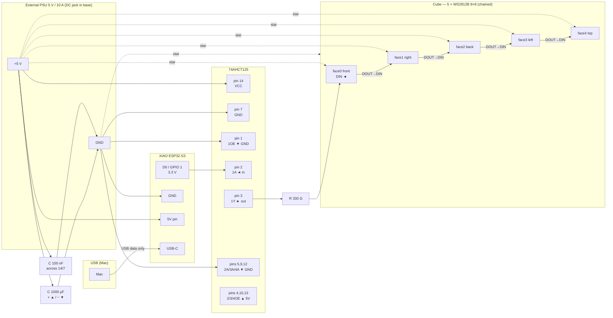

# HARDWARE — cube hardware

Hardware assembled, tested, working. All 320 LEDs (5 × 8×8) driven correctly
at working brightness with no issue. This document describes the components,
wiring and lessons learned.

See [README.md](../README.md) for the project overview, [CLAUDE.md](../CLAUDE.md)
for the current state and firmware gotchas, and [SOFTWARE.md](SOFTWARE.md) for
the daemon/firmware architecture.

---

## Components

| Item | Reference / type | Role |
|---|---|---|
| Microcontroller | Seeed **XIAO ESP32-S3** | Drives the LEDs, receives commands from the Mac |
| LED matrices | 5 × BTF-LIGHTING WS2812B 8×8 (64 px each) | The five lit faces (320 px) |
| Level shifter | 74AHCT125 (DIP-14) | Adapts the data signal 3.3 V → 5 V |
| Resistor | 330 Ω | Dampens the data line |
| Capacitor (reservoir) | 1000 µF / 16 V (electrolytic) | Buffers current spikes |
| Capacitor (decoupling) | 100 nF / 0.1 µF | Decouples the 74AHCT125 |
| Power supply | External 5 V / 10 A brick | Feeds the LEDs and the chip |
| Base connectors | Panel-mount USB-C (data), DC jack, on/off switch | Deported I/O in the socle |
| Structure | 3 mm plywood faces, 18 mm plywood base, nylon standoffs | Cube + socle |
| Wiring | 22 AWG (LED 5V/GND/data), 18 AWG (main power) | Interconnect |

### Description of each item

**XIAO ESP32-S3** — compact ESP32-S3 board (21 × 17.5 mm). Same chip family as
Claudine's DevKit but far smaller, so it fits inside the cube. Programmed and
fed data via its USB-C port. Outputs the LED data signal at 3.3 V on **D0
(GPIO 1)**. **Soldered directly to the PCB** (no headers — not removable).
Powered at 5 V from the external supply through its 5V pin; USB-C carries data
only.

**5 × WS2812B 8×8 matrices** — 320 individually addressable RGB LEDs total.
Each panel is a single serpentine of 64 LEDs; the five panels are **chained**
(DOUT of one → DIN of the next). Color order: **GRB**. Chain order:
front (0) → right (1) → back (2) → left (3) → top (4). Each expects a 5 V
supply and a data signal recognized as 5 V.

**74AHCT125 level shifter** — 4-buffer chip; only one is used. Raises the
3.3 V data signal from the XIAO to a clean 5 V level, essential for the
matrices to recognize it reliably. Powered at 5 V (pin 14 = VCC, pin 7 = GND).

**330 Ω resistor** — In series on the data line, just before the first
matrix DIN. Dampens signal reflections.

**1000 µF capacitor** — Electrolytic, **polarized**, mounted across the
+5 V / GND at the power input. Reservoir buffer to absorb the current spikes
when many LEDs turn on at once.

**100 nF capacitor** — Non-polarized, mounted across VCC/GND **as close as
possible to the 74AHCT125** pins 14 and 7. Decouples the high-frequency
switching noise of the buffer.

**External 5 V / 10 A power supply** — Provides current for the LEDs and the
chip via a DC jack in the base. USB-C only carries data and (optionally) feeds
the XIAO while flashing. Holds 320 LEDs comfortably (working brightness ~0.08
draws ~1.5 A of the 10 A available).

**Base (socle)** — 18 mm plywood, raised on rubber feet. Houses a panel-mount
USB-C connector **with data lines** (not a power-only red/black type), the DC
jack, and an on/off switch on the 5 V line. A grommeted hole passes the USB
cable up to the XIAO.

---

## Wiring diagram

### Logical view of the connections

> The 1000 µF capacitor is polarized: **+** leg (long) to the 5 V rail,
> **−** leg (stripe side) to the GND rail, mounted at the power input.

### Key connections

- **Data signal**: D0 (GPIO 1) → pin 2 (1A) → pin 3 (1Y) → 330 Ω resistor →
  face 0 DIN → chained DOUT→DIN across faces 1..4.
- **LED power — STAR topology**: each face's +5 V and GND run **directly to
  the PCB**, not daisy-chained from the previous face. On each PCB→face lead,
  only face 0 uses the DATA wire; the DATA wires of the face 1..4 leads are
  **left isolated** (their DIN comes from the previous face's DOUT).
- **Chip power**: pin 14 → +5 V, pin 7 → GND.
- **Buffer enable**: pin 1 (1OE) → GND (activates the used buffer).
- **Unused inputs**: pins 5, 9, 12 (2A/3A/4A) → GND (prevents floating).
- **Unused output-enables**: pins 4, 10, 13 (2OE/3OE/4OE) → 5 V (disables them).
- **Unused outputs**: pins 6, 8, 11 (2Y/3Y/4Y) → left unconnected.
- **Decoupling**: 100 nF across pins 14/7, as close to the chip as possible.
- **Common ground**: XIAO, chip, matrices and PSU all share the same GND.
- **Important**: the USB-C 5 V is **NOT** connected to the 5 V rail
  (don't mix USB and external power). Nominal operation runs both USB (data)
  and the DC jack (power) plugged in — tolerated by the XIAO. To flash: USB
  only, DC jack unplugged.

---

## LED chain mapping (physical)

Relevé LED-by-LED on the assembled cube. Logical convention used everywhere:
**x = column (0 left … 7 right), y = row (0 bottom … 7 top)**.

- **Side faces (front/right/back/left)** — origin bottom-left, the chain
  climbs a full column (bottom→top) then moves to the next column right:
  `index_local = x*8 + y`.
- **Top face** — origin top-left, the chain runs a full row left→right then
  drops one row: `index_local = (7 - y)*8 + x`.
- Global index: `face*64 + index_local`, face ∈ {0 front, 1 right, 2 back,
  3 left, 4 top}.

Implemented and auto-tested in `lib/cube_mapping.rb`. The **top-face rotation**
is calibrated: rising up a side face continues onto the top with the same `x`
and increasing `y` (validated with `test/test_cube_edge.rb`). The three other
side↔top edges (right/back/left) are not calibrated yet — only needed for future
effects that cross them.

---

## Power-up sequence

1. Plug in the USB-C (the XIAO boots, data link to the Mac)
2. Switch on the base / plug the external PSU into the mains
3. Press RST on the XIAO if needed

Shutdown: reverse order (mains/switch first, USB last).

To flash firmware: USB-C only, DC jack unplugged (avoids two 5 V sources
meeting).

---

## Hardware lessons learned

- **XIAO data pin**: D0 = **GPIO 1** in the firmware (`#define DATA_PIN 1`),
  replacing the DevKit's GPIO 16.
- The 3.3 V data signal is **NOT** reliably recognized by the matrices without
  the level shifter → 74AHCT125 mandatory (same as Claudine).
- USB power alone cannot sustain full-white on 320 LEDs → external supply
  **mandatory** for real use; USB-only is fine only for low-brightness tests.
  Measured with `test/test_cube_stress.rb` (2026-07): with the DC jack in,
  **full-white 100 % on all 320 LEDs holds with no visible artifact** (no hue
  shift, flicker, or ESP brownout) — the ~19 A theoretical worst case is very
  pessimistic, the 10 A supply copes cleanly. On **USB only** (no jack), white
  is fine at ~8 % but the ESP browns out (LEDs blink) **between 20 % and 25 %**
  white — i.e. the USB source caps out around ~4 A worst-case-theoretical.
  Practical display limit is thermal (sustained use), not display integrity.
- **Star power topology** was chosen over daisy-chaining the faces: each face
  gets its 5 V/GND straight from the PCB, guaranteeing uniform color even if
  brightness is raised later.
- **Test each face before gluing.** Faces were validated electrically
  (R/G/B uniform) while still loose, taped into a cube for the mapping relevé,
  and only then assembled — so any cold joint stayed reachable.
- **Leave slack loops** on inter-face data wires: the faces move relative to
  each other during assembly and when opening the removable bottom.
- Solder iron tip erodes over time (a pit formed) — keep it tinned, moderate
  temperature (~330 °C), brass wool rather than abrasives; replace the tip when
  a crater appears (don't file it).
- **1st physical LED of each side face is bottom-left**; the top face starts
  top-left. These quirks are absorbed entirely in `cube_mapping.rb` (no
  FLIP_X/FLIP_Y needed — the per-face formulas handle it).
- **Not every "downstream garbage" is a wiring fault.** During bring-up, colors
  went garbled past a *moving* boundary (~LED 85–128), which looked exactly like
  a cold joint or a bad DOUT→DIN link between panels. It was **software**: the
  firmware's USB-CDC serial RX buffer (256 B default ≈ 85 LEDs) overflowed while
  `show()` blocked, dropping the tail of each frame. Tell: a *moving* boundary
  points to timing/software, a *fixed* one to hardware. A standalone on-device
  animation sketch lit all 320 LEDs cleanly, exonerating the hardware. Fixed on
  the firmware side (`Serial.setRxBufferSize`); see [SOFTWARE.md](SOFTWARE.md)
  and [CLAUDE.md §3](../CLAUDE.md).
- **FastLED is unreliable on this XIAO S3 / IDF5** — the firmware uses Adafruit
  NeoPixel (native Arduino RMT) instead. Details in CLAUDE.md §3.
