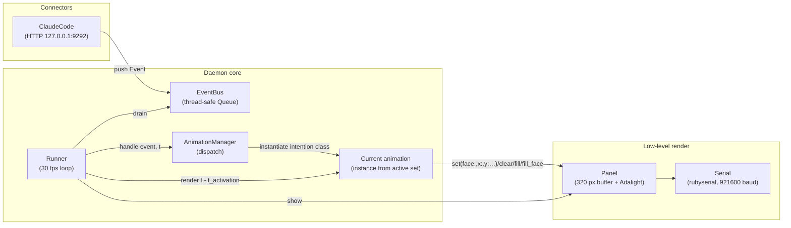
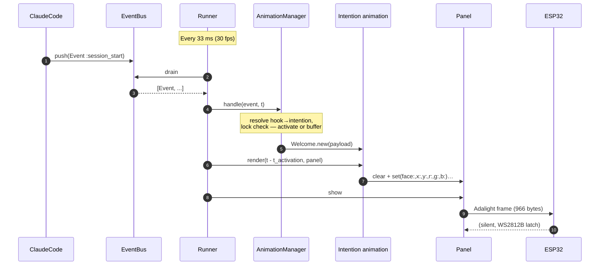
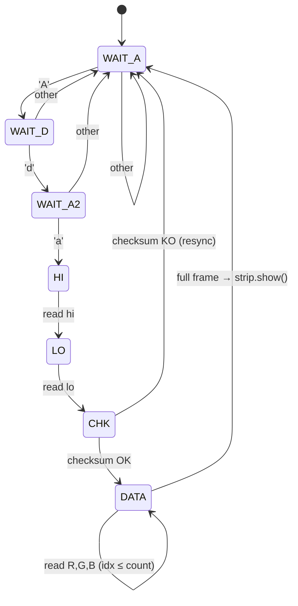
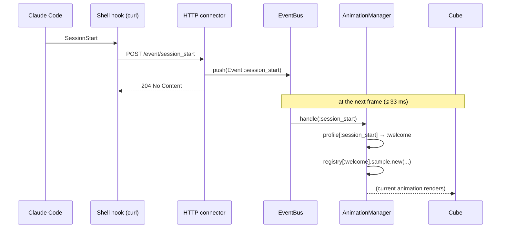

# SOFTWARE — Ruby daemon and ESP32 firmware

Two software pieces collaborate over a USB serial link:

- **ESP32 firmware** (`sketch_firmware/`) — a few dozen lines of C++/Arduino,
  decoding the Adalight protocol and pushing the received pixels onto the LED
  chain via **Adafruit NeoPixel**. No animation intelligence.
- **Ruby daemon** (`claudine.rb` + `lib/`) — the business logic: an event bus,
  a fixed-cadence render loop, animations that paint the pixels, and connectors
  that listen to external sources and push events onto the bus.

See [README.md](../README.md) for the overview and [HARDWARE.md](HARDWARE.md)
for the hardware. This is the port of the flat 16×16 Claudine to the 5-face
8×8 cube (320 LEDs): the architecture is identical, only the `Panel` geometry,
the firmware LED driver, and the animation set changed.

---

## Daemon architecture



A frame, from the Runner's point of view:



---

## Components — role and file

| Component | File | Role |
|---|---|---|
| `Claudine::Panel` | `lib/panel.rb` | Opens the serial port, manages the 320-pixel buffer, encodes/sends Adalight frames, maps `(face, x, y)` → chain index via `CubeMapping`, applies Ruby-side brightness |
| `Claudine::Runner` | `lib/runner.rb` | Fixed-cadence render loop, drains the bus, calls `manager.render` then `panel.show`, handles Ctrl-C |
| `Claudine::EventBus` | `lib/event_bus.rb` | Thread-safe event queue (`Queue`): connectors `push`, the Runner `drain`s |
| `Claudine::Event` | `lib/event.rb` | Immutable value object `Data.define(:type, :payload)` |
| `Claudine::AnimationManager` | `lib/animation_manager.rb` | Loads the active set at startup (`CLAUDINE_ANIMATION_SET`, default `cube`), builds an `intention => [Class,…]` registry; on an event it maps the raw hook type → intention via the active profile, resolves the intention against the set (walking `Intentions.resolve`'s fallback chain if absent), instantiates a fresh animation, and applies the display lock and idle switch |
| `Claudine::Animations::Base` | `lib/animations/base.rb` | Contract `render(t, panel)` where `t` is time-since-activation |
| `Claudine::Animations::Cube::CubeBase` | `lib/animations/cube/_base.rb` | Shared volumetric helpers for the cube set (see below) |
| `Claudine::Animations::Cube::<Intention>` | `lib/animations/cube/<intention>.rb` | One file per intention (e.g. `think.rb` → `Cube::Think`, `welcome.rb` → `Cube::Welcome`) |
| `Claudine::Intentions` | `lib/intentions.rb` | The 16-intention `VOCAB` (each mapped to a `kind` + `fallback`), the mandatory `CORE = %i[think stop sleep]`, and helpers `kind` / `fallback` / `resolve(intention, available)` (cycle-safe fallback walk) |
| `Claudine::Profiles::CLAUDE_CODE` | `lib/profiles/claude_code.rb` | Data hash mapping the 16 Claude Code hook types 1:1 to intentions (e.g. `session_start → welcome`, `user_prompt → think`, `stop → stop`) |
| `Claudine::Connectors::ClaudeCode` | `lib/connectors/claude_code.rb` | Small local HTTP server, pushes the raw hook type onto the bus (the profile does the hook→intention translation, in the manager) |
| `Claudine::Settings` | `config/settings.rb` | Config constants (port, baud, 8×8×5 size, faces, brightness) |
| `Claudine::Logger` | `lib/logger.rb` | Simple logger, level via `CLAUDINE_LOG_LEVEL` |
| Arduino firmware | `sketch_firmware/sketch_firmware.ino` | Decodes Adalight, pushes to the chain via Adafruit NeoPixel |

The entry point is `claudine.rb`: it builds the `AnimationManager`, the
`Runner` and the `ClaudeCode` connector, then starts the loop. No hook-specific
config lives there — each animation carries its own colors/motion in its file.

> `lib/text/font_3x5.rb` and `lib/text/renderer.rb` are retained from Claudine
> but **not used** by the cube set (which is text-free). The renderer still uses
> the old positional `panel.set(x, y, …)`; it would need porting to the per-face
> API to draw text on a single 8×8 face.

---

## Important concepts

### Cube LED mapping

Each face is an 8×8 grid addressed in **logical coordinates**: `x = column`
(0 left … 7 right), `y = row` (0 bottom … 7 top). `Panel#set(face:, x:, y:, …)`
turns that into a global chain index via `CubeMapping.index`:

```
Chain order:  0 front, 1 right, 2 back, 3 left, 4 top   (face F → 64*F … 64*F+63)

Side faces (0..3):  index_local = x*8 + y        (origin bottom-left, climbs a column)
Top face   (4):     index_local = (7 - y)*8 + x  (origin top-left, runs a row)
```

There is **no serpentine transform and no FLIP_X/FLIP_Y** anymore — the physical
wiring of each face is entirely absorbed by these per-face formulas.
`lib/cube_mapping.rb` carries a self-test (`ruby lib/cube_mapping.rb`). The
top-face rotation is calibrated so that rising up a side face continues onto the
top with the same `x` and increasing `y` (validated via `test/test_cube_edge.rb`).

### Adalight protocol

A trivial protocol for carrying a frame of pixels over a serial port. Each
frame starts with a 6-byte header, followed by `(N+1) × 3` RGB bytes.

```
┌──────────────────── Header (6 bytes) ────────────────────┬── Data (N+1)×3 ──┐
│ 'A' │ 'd' │ 'a' │ hi │ lo │ hi ^ lo ^ 0x55               │ R₀ G₀ B₀ R₁ G₁…  │
└─────┴─────┴─────┴────┴────┴──────────────────────────────┴──────────────────┘
                     │    │      │
       (LED count-1) └────┘      checksum (XOR + 0x55)
        little-endian 16 bits
```

For the cube: `N = 320`, so `count = 319 = 0x013F`, `hi = 0x01`, `lo = 0x3F`,
`checksum = 0x01 ^ 0x3F ^ 0x55 = 0x6B`. Total frame: **6 + 960 = 966 bytes**.

On the ESP32, a small state machine reads byte by byte and waits for the magic
`'A' 'd' 'a'` before accepting a header:



If a byte is lost, the state machine resyncs on the next valid `'A' 'd' 'a'`.

### GRB color order

WS2812B LEDs expect bytes in **G, R, B** order. This is absorbed on the ESP32
side (`Adafruit_NeoPixel(..., NEO_GRB + NEO_KHZ800)`), so the Ruby side reasons
in normal R, G, B.

### Ruby-side brightness

The firmware runs the LEDs at full brightness; dimming happens on the Ruby side
via `Panel#scale`, applying `Settings::BRIGHTNESS` (0.0–1.0, currently 0.08) on
each channel before sending. Keeps the Ruby loop the single source of truth and
avoids reflash roundtrips. At 0.08 the cube draws ~1.5 A.

### LED driver and the serial RX buffer (hard-won)

Two firmware decisions were forced by hardware reality on the XIAO ESP32-S3 with
FastLED 3.10 / ESP-IDF 5.x — both cost real debugging time:

1. **NeoPixel, not FastLED.** Every FastLED backend was unusable here: RMT5
   (default) crashes its DMA cache sync (`esp_cache_msync … invalid addr`) and
   corrupts the chain; RMT4 legacy won't compile on IDF5; the I2S driver has no
   S3 implementation (link errors); the SPI clockless driver enqueues frames
   without transmitting. Adafruit NeoPixel uses the Arduino core's native RMT
   path (the one behind the onboard RGB LED) and just works.
2. **`Serial.setRxBufferSize(4096)` before `Serial.begin()`.** The original
   symptom looked like a mapping or wiring bug: colors went garbled past a
   *moving* boundary (~LED 85–128). Root cause: while `strip.show()` blocks the
   loop (~10 ms for 320 LEDs), the Mac already streams the next frame; the
   default 256-byte USB-CDC RX buffer (~85 LEDs) overflows and the tail of the
   frame is dropped/shifted. A missing byte in the DATA phase misaligns every
   later pixel while the firmware still latches — clean prefix, garbled tail, at
   a timing-dependent position. Enlarging the RX buffer to hold a full 966-byte
   frame fixes it. (This is the same failure mode noted in Claudine's old
   "why not 60 fps" analysis — here it hit even at 30 fps because a full cube
   frame is larger and `show()` blocks longer.)

The hardware itself is sound (confirmed by a standalone on-device animation
sketch lighting all 320 LEDs cleanly).

### Render cadence and serial throughput

- **Baud**: 921600. `rubyserial`'s baud table only natively knows rates up to
  230400 on macOS; `lib/rubyserial_patch.rb` extends it via a `default_proc` so
  any integer passes through (macOS writes the raw value into `c_ispeed`/
  `c_ospeed`).
- **Throughput**: 921600 baud ≈ 92 kB/s; a 966-byte frame fits in ~10 ms on the
  wire.
- **Cadence**: 30 fps (`Settings::FPS`), comfortable for 320 LEDs.

### Threading and thread-safety

- **Main thread**: Runner, blocking 30 fps render loop.
- **Connector thread(s)**: each connector spawns its own thread (`ClaudeCode`
  does `Thread.new { serve }` with a blocking `TCPServer#accept`).

Communication goes through an `EventBus` based on `Queue` (thread-safe). The
Runner calls `drain` at frame start, emptying the queue with a `pop(true)` loop
until `ThreadError`. Animations do no threading of their own — they're driven by
the Runner ticks.

---

## Animation sets

An **animation set** is a directory under `lib/animations/` with one `.rb` file
per **intention** (not per Claude Code hook). The filename matches the intention
and the class is its CamelCase form: `think.rb` → `Think`, `welcome.rb` →
`Welcome`, `sleep.rb` → `Sleep`. The active set is picked at startup via
`CLAUDINE_ANIMATION_SET` (default `cube`).

The 16 intentions and their temporal roles live in `lib/intentions.rb`
(`Claudine::Intentions::VOCAB`); the full vocabulary is documented in
[INTENTIONS.md](INTENTIONS.md). A **profile** (`lib/profiles/claude_code.rb`)
maps a source's raw events to intentions, so a set never mentions a hook name.

Only the **`cube`** set ships today. The flat Claudine sets
(`default`/`fancy`/`abstract`/`bunny`) and the `EventLabel` text base were
removed: they assume a 16×16 plane and the 3×5 font doesn't fit an 8×8 face.

```
lib/animations/
  base.rb            # Base contract: render(t, panel)
  cube/              # default set — text-free, volumetric
    _base.rb         # Cube::CubeBase — shared helpers (not an intention)
    welcome.rb       # Cube::Welcome
    think.rb         # Cube::Think
    start.rb
    finish.rb
    handle.rb
    handled.rb
    fork.rb
    join.rb
    wait.rb
    retry.rb
    save.rb
    saved.rb
    stop.rb
    fail.rb
    bye.rb
    sleep.rb         # dormant idle intention — see Idle mode
```

**Loader conventions**:

- Files whose basename starts with `_` (e.g. `_base.rb`) are set-internal
  helpers: `require`d so their constants/methods are available, but NOT
  registered as intentions.
- `sleep` is a normal intention (kind `dormant`); the manager triggers it
  internally on idle rather than from a connector. There is no longer any
  `system_` filename convention.
- Files ending in `_<digits>` (e.g. `wait_2.rb`, `think_2.rb`) are extra
  **variations** of the base intention; the manager picks one at random per
  activation. This is how frequent intentions (`start` / `finish`) can avoid
  looking identical.

### `CubeBase` helpers

Every cube animation subclasses `Cube::CubeBase` and paints via these
(coordinates in `(face, x, y)`; the physical wiring is handled by `CubeMapping`):

| Helper | Effect |
|---|---|
| `wave(t, period)` | 0..1 sine |
| `dim(rgb, k)` | scale a color by 0..1 |
| `fill(panel, rgb)` / `face_fill(panel, face, rgb)` | whole cube / one face |
| `px(panel, face, x, y, rgb)` | one pixel (bounds-checked, integer-coerced) |
| `ring_px` / `ring_row` | the "ring" of the 4 side faces as 32 wrap-around columns |
| `face_ring(panel, face, d, rgb)` | concentric square ring at border-distance `d` |
| `top_ring(panel, d, rgb)` | `face_ring` on `:top` |
| `top_edge_px(face, x, ring)` | map a side column to a top-border pixel (front→top calibrated) |

Constants: `ALL_FACES`, `LATERAL` (the 4 sides), `SIDE` (8), `RING` (32).

### Design constraint: colorblind-safe

The maintainer is mildly colorblind, so **every event is distinguishable by
motion / shape / brightness, not color alone** (no red↔green or yellow↔green
distinctions). E.g. `finish` is a single flash while `retry` is a
double blink; `save` converges while `saved` expands.

### Example animations

Whole-cube breathing:

```ruby
class Welcome < CubeBase
  PERIOD = 3.0
  BASE   = [0, 200, 0]
  def render(t, panel)
    fill(panel, dim(BASE, wave(t, PERIOD)))
  end
end
```

A wave rising the 4 side faces, then closing inward on the top:

```ruby
class Think < CubeBase
  SPEED = 16.0; SPREAD = 2.0; COLOR = [0, 180, 220]
  def render(t, panel)
    panel.clear
    head = t * SPEED
    SIDE.times { |y| k = 1.0 - (head - y).abs / SPREAD; ring_row(panel, y, dim(COLOR, [k,1.0].min)) if k > 0 }
    crest = head - SIDE
    4.times { |d| k = 1.0 - (crest - d).abs / SPREAD; top_ring(panel, d, dim(COLOR, [k,1.0].min)) if k > 0 }
  end
end
```

### Display lock (latest-wins buffering)

When events arrive faster than the current animation can play out, the cube
would thrash. `AnimationManager` applies a **display lock**:

- After activating an animation at time `t`, it refuses to activate a new one
  until `MIN_DURATION` seconds have elapsed (default
  `Settings::MIN_ANIMATION_DURATION` = 0.6 s; overridable per class via a
  `MIN_DURATION` constant — used by `Retry`, `Fail`,
  `Bye`, the save/saved animations, so their gesture plays through).
- Events during the lock are **buffered in one slot** (latest wins, older
  dropped). When the lock expires the pending event is applied.
- The connector never blocks: it always accepts POSTs and pushes onto the bus.

Tuning: `config/settings.rb → MIN_ANIMATION_DURATION` (global) and per-class
`MIN_DURATION`.

### Working-state model (background + overlays)

A single "one animation at a time" model left the cube dark during *thinking*:
after `think` played its wave once, nothing was active until the next
event (or idle at 90 s). To fix that, `AnimationManager` runs a **two-layer
model** driven by each intention's **kind** (from `Intentions.kind`, not a
hardcoded event list — the old `BACKGROUND_EVENTS` / `CLEAR_EVENTS` constants
are gone). The four kinds are:

- **ambient** (`think`) starts a persistent "busy/working" loop. `think` loops
  its wave and keeps playing — this is the thinking indicator.
- **boundary** (`welcome` / `stop` / `fail` / `bye`) is terminal: it ends the
  background and displays its own thing (e.g. `stop` breathes until the next
  prompt).
- **pulse** (everything else) is a transient overlay: it plays once for its
  `MIN_DURATION`, then `render` reverts `@current` to the background loop
  (resuming it continuously from `@background_activated`, so the wave doesn't
  restart). `start` / `finish` are therefore brief one-shot markers over
  the working loop.
- **dormant** (`sleep`) is the idle animation (see Idle mode).

So a typical turn looks like: `think` (loop starts) → `start` (overlay
0.6 s) → back to loop → `finish` (overlay) → back to loop → … → `stop` (loop
ends). Going idle also clears the background. The display lock still governs how
fast a *new* event can take over; the overlay→background revert is internal (not
an event) and needs no lock. Verified by `test/test_manager_states.rb`.

Which temporal role an intention has is data: its `kind` in
`Intentions::VOCAB` (`lib/intentions.rb`), not a per-set or per-manager list.

### Idle mode

After `Settings::IDLE_TIMEOUT` seconds without any event (default **90 s**;
`nil` to disable), the manager triggers the `sleep` intention (kind `dormant`).

- The `cube` set ships `sleep.rb` (dim night-blue breathing with a slow
  orbiting spark). Optional variants `sleep_2.rb`, … would be picked at
  random.
- If a set has no `sleep`, the manager just `panel.clear`s once at timeout
  (unchanged behavior).
- The display lock is **bypassed while idle**: any incoming event wakes the cube
  instantly.

Tuning: `config/settings.rb → IDLE_TIMEOUT`.

### Extensibility: adding a source

Adding a source is now **data + a connector**, with zero changes to the render
path:

1. Write a **profile** (like `lib/profiles/claude_code.rb`) — a data hash
   mapping the source's raw event types to intentions from the vocabulary.
2. Write a **connector** that (a) receives the bus in its constructor and
   (b) pushes a `Claudine::Event` with the raw event type as `:type`.

The manager translates event → intention via the profile and resolves it
against the active set (falling back along `Intentions.resolve` if the set lacks
that intention). No per-source animation files are needed, and no change is
needed in the Runner, the Panel, or the AnimationManager.

---

## ESP32 firmware

Environment: **Arduino IDE 2.x**, board **XIAO_ESP32S3**, library **Adafruit
NeoPixel**. Baud **921600** (must match `Settings::BAUD`).

`sketch_firmware/sketch_firmware.ino`, in short:

- `Serial.setRxBufferSize(4096)` then `Serial.begin(BAUD)` (the buffer size is
  mandatory — see [above](#led-driver-and-the-serial-rx-buffer-hard-won)).
- `strip.begin()` (Adafruit NeoPixel, `NEO_GRB + NEO_KHZ800`, `DATA_PIN 1`,
  `NUM_LEDS 320`).
- Adalight state machine (see diagram). On a full frame → `strip.show()` → back
  to `WAIT_A`.

Flash with USB only, DC jack unplugged. Close the Serial Monitor before running
the daemon.

> ⚠ After changing `#define BAUD`, reflash then update `Settings::BAUD` to match.

---

## Ruby daemon

### Environment

- **Ruby 4.0.5** (rbenv, `.ruby-version`).
- **Gem**: `rubyserial` (`Serial` class). Do NOT use `serialport` (fails on high
  baud) or `uart` (Ruby 4 compat unconfirmed).
- The serial port opens **one program at a time** — close the Arduino Serial
  Monitor first.
- Opening the port **reboots the XIAO** → `Panel#initialize` does `sleep 2`
  before sending. (Consequence: a test run right after opening the port may need
  a second run to display — the first frame lands during the reboot.)
- Find the port: `ls /dev/cu.*` → `/dev/cu.usbmodem11201` here. Set in
  `config/settings.rb`.

### Install and run

```bash
bundle install
ruby claudine.rb
```

Env vars: `CLAUDINE_LOG_LEVEL=DEBUG` (default `INFO`), `CLAUDINE_ANIMATION_SET`
(default `cube`; `bunny` complete — all 16 intentions), `CLAUDINE_BRIGHTNESS` (overrides
`Settings::BRIGHTNESS`, default `0.08`). Clean shutdown `Ctrl-C` (blanks the cube
then closes the port).

### Project layout

```
claudine-cube/
├─ claudine.rb                  # Entry point: AnimationManager + Runner + ClaudeCode
├─ config/settings.rb           # Port, baud, 8×8×5=320, faces, brightness
├─ lib/
│  ├─ cube_mapping.rb           # (face,x,y) → chain index (+ self-test)
│  ├─ panel.rb                  # 320 px buffer, Adalight, per-face mapping, brightness
│  ├─ runner.rb                 # 30 fps loop, bus drain, Ctrl-C
│  ├─ event.rb                  # Data.define(:type, :payload)
│  ├─ event_bus.rb              # Thread-safe Queue (push / drain)
│  ├─ intentions.rb             # VOCAB (16 intentions: kind + fallback), CORE, resolve
│  ├─ profiles/
│  │  └─ claude_code.rb         # CLAUDE_CODE: hook type → intention (data)
│  ├─ animation_manager.rb      # Loads active set, maps hook→intention, dispatches per intention
│  ├─ logger.rb                 # Simple logger (CLAUDINE_LOG_LEVEL)
│  ├─ rubyserial_patch.rb       # Extends rubyserial's known baud rates
│  ├─ animations/
│  │  ├─ base.rb                # Contract: render(t, panel)
│  │  └─ cube/                  # default set (text-free, volumetric)
│  │     ├─ _base.rb            # CubeBase helpers (not an intention)
│  │     ├─ think.rb
│  │     └─ … (16 intention files incl. sleep.rb)
│  ├─ text/                     # font_3x5 + renderer — retained, unused by cube set
│  └─ connectors/
│     └─ claude_code.rb         # HTTP 127.0.0.1:9292 → pushes raw hook type
├─ sketch_firmware/
│  ├─ sketch_firmware.ino       # ESP32 firmware (Adalight + NeoPixel)
│  └─ testing/                  # standalone hardware diagnostic sketches
│     └─ flashing_colors.ino    # cycles colors over all 320 LEDs (no serial)
└─ test/
   ├─ test_cube_faces.rb        # one color per face (order + mapping)
   ├─ test_cube_edge.rb         # all 8 shared edges, both sides (edge calibration)
   ├─ test_cube_preview.rb      # play the animations on the cube
   ├─ test_cube_animations.rb   # dry-run all animations (no hardware)
   └─ test_manager_states.rb    # two-layer background/overlay model (no hardware)
```

---

## Claude Code connector

A minimalist HTTP server (no framework) listens on `127.0.0.1:9292`. Claude
Code hooks are configured in `.claude/settings.json` to `curl -sX POST` this
endpoint at each lifecycle event.



The connector pushes the raw hook type onto the bus; it holds no mapping. In the
manager, the active **profile** (`Profiles::CLAUDE_CODE`) maps that hook to an
intention, and the active **set** provides the animation for that intention.
Which visual you get therefore depends on both the profile and the set. The
`cube` set's per-intention visuals and their motion signatures are tabulated in
[README.md](../README.md#the-cube-animation-set). The last event received stays
displayed until the next one (or until idle).

---

## Text rendering (retained, unused)

`lib/text/font_3x5.rb` (a 3×5 bitmap font, A-Z/0-9/space/hyphen) and
`lib/text/renderer.rb` come from Claudine, where labels were drawn on the 16×16
plane. The cube set is text-free, so they are currently **unused**. The renderer
still calls the old positional `panel.set(x, y, r, g, b)`; to reuse it (e.g. a
short label on a single face), port it to `panel.set(face:, x:, y:, …)`.

---

## Evolution

This document describes **what exists**. The evolution backlog — near-term ideas
plus the bigger tracks (the decided **intention layer**, the **animation
marketplace** vision) — lives in a single place: **[IDEAS.md](IDEAS.md)**.
